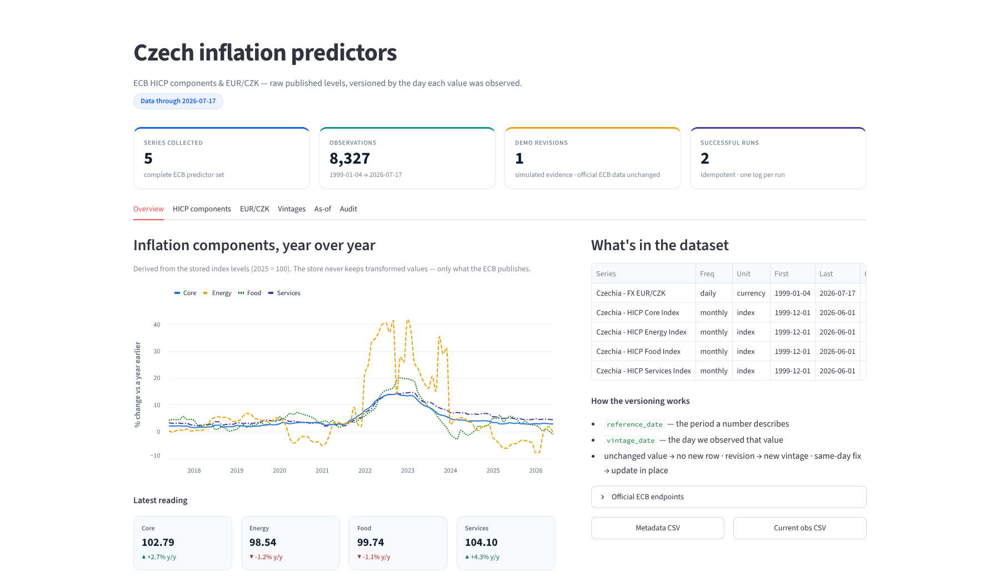
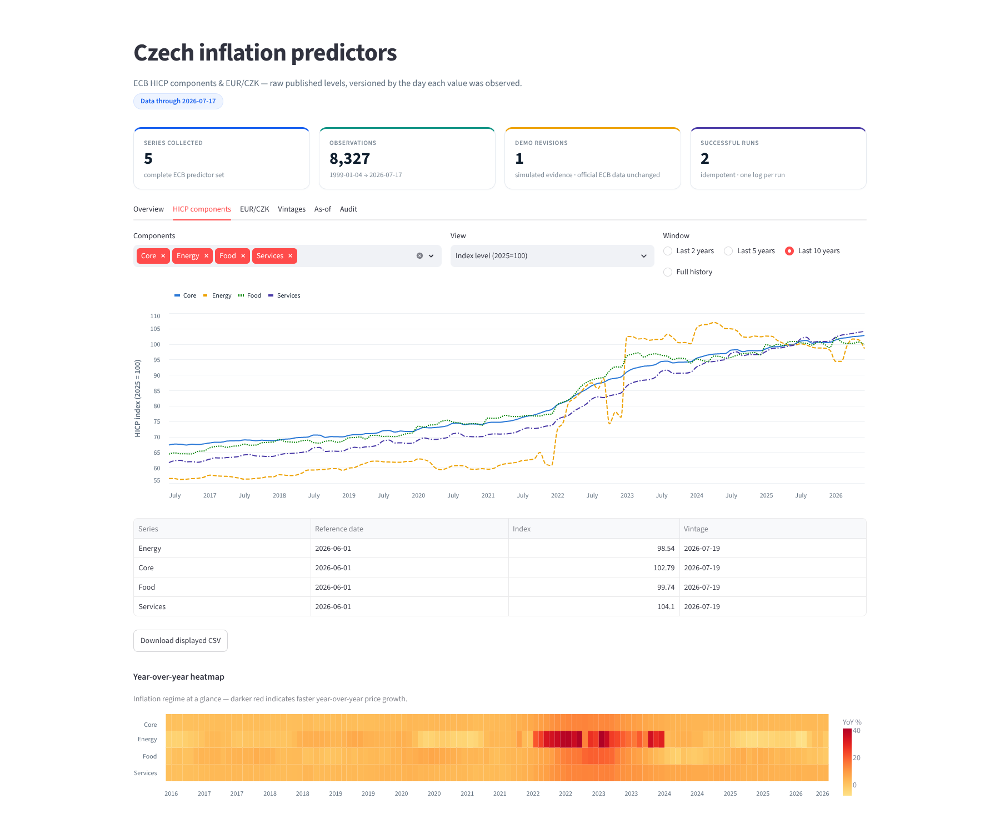
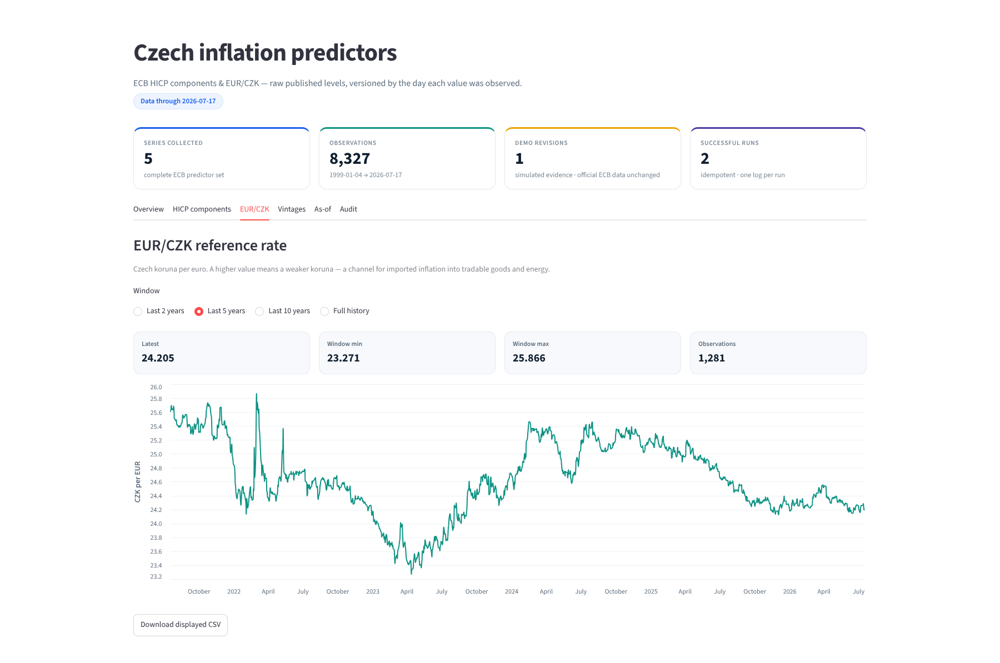
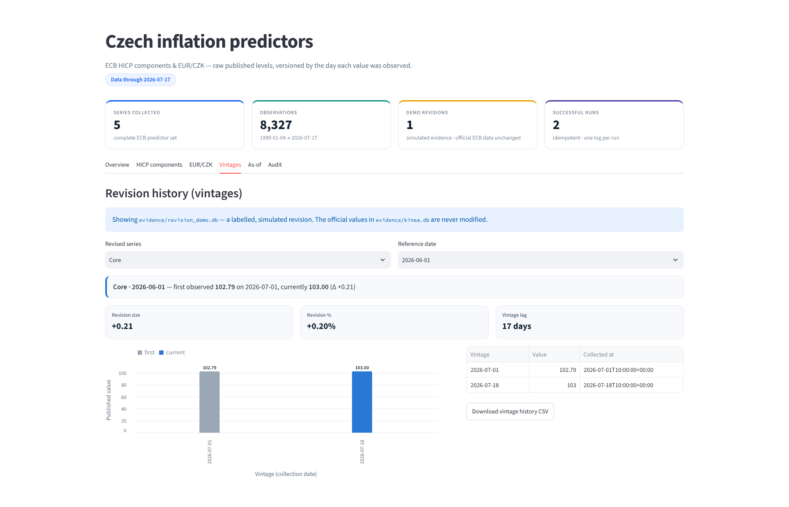
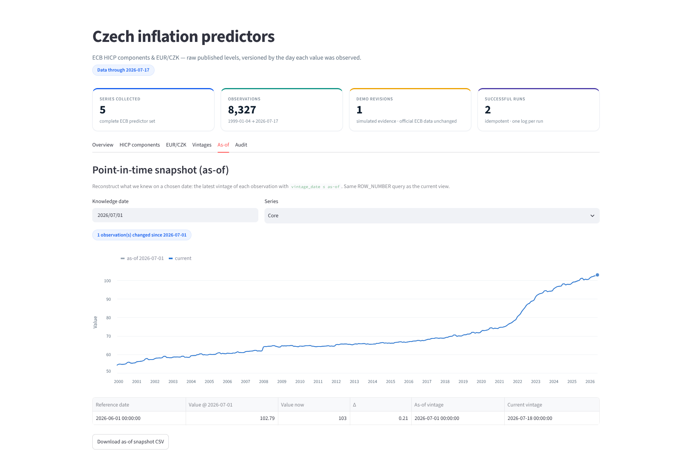
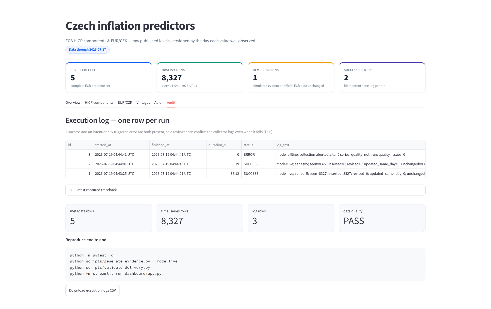

# Kinea Collector — Czech inflation predictors

[](https://github.com/lucasweber1202/Kinea/actions/workflows/validate.yml)


This repository is the complete submission for the Kinea internship assignment. It collects
four Czech HICP components and EUR/CZK from the European Central Bank, stores the raw published
levels in the required relational schema, preserves revisions as vintages, supports current and
historical as-of queries, and presents the result in a Streamlit dashboard.

The collector in `kinea/` uses only the Python standard library. Dashboard and test dependencies
are optional extras. No API key or secret is required.

For a compact release checklist and evidence map, see [`DELIVERY.md`](DELIVERY.md).

## Reviewer quick start

```bash
python -m pip install -e ".[dev,dashboard,modeling]"
python -m pytest -q
python scripts/validate_delivery.py
python -m streamlit run dashboard/app.py
```

After installation, the equivalent one-command verification is `make verify`.

The committed delivery contains a live ECB database and pre-generated evidence, so the validator
does not need network access. A successful validation prints a `PASS` line for every invariant and
ends with `DELIVERY STATUS: READY`.

| Review target | Location |
|---|---|
| Exact `metadata`, `time_series`, and `logs` schema | `kinea/db.py` |
| Four vintage rules and idempotency | `kinea/vintages.py` |
| HTTP timeout, retry, and backoff | `kinea/client.py` |
| SDMX-CSV parsing and record-level warnings | `kinea/parser.py` |
| Guaranteed final execution log | `kinea/collector.py` |
| Current and as-of queries | `kinea/db.py`, `kinea/cli.py` |
| Look-ahead-free modeling panels | `kinea/panels.py`, `evidence/pit_panel.parquet` |
| Semantic data-quality gate | `kinea/quality.py`, `evidence/data_quality.txt` |
| Recorded/live ECB contracts | `fixtures/contracts/`, `.github/workflows/source-contract.yml` |
| Live populated SQLite database | `evidence/kinea.db` |
| Labelled revision demonstration | `evidence/revision_demo.db` |
| Fail-closed delivery audit | `scripts/validate_delivery.py` |
| Six-section dashboard | `dashboard/app.py`, `docs/dashboard-*.png` |

## Data source and series

The ECB was selected because its public SDMX API requires no credentials and publishes all five
requested predictors. Internal structured IDs remain separate from the external ECB keys.

| Internal `series_id` | ECB key | Frequency | Unit | Analytical role |
|---|---|---|---|---|
| `CZ_FX_EURCZK` | `EXR.D.CZK.EUR.SP00.A` | daily | currency | exchange-rate pass-through |
| `CZ_HICP_CORE_INDEX` | `HICP.M.CZ.N.XEF000.4D0.INX` | monthly | index | underlying inflation |
| `CZ_HICP_ENERGY_INDEX` | `HICP.M.CZ.N.NRGY00.4D0.INX` | monthly | index | energy shocks |
| `CZ_HICP_FOOD_INDEX` | `HICP.M.CZ.N.FOOD00.4D0.INX` | monthly | index | food-price pressure |
| `CZ_HICP_SERVICES_INDEX` | `HICP.M.CZ.N.SERV00.4D0.INX` | monthly | index | services inflation |

HICP is stored as the raw index level (2025 = 100), not an annual rate. EUR/CZK is stored as the
raw number of Czech koruna per euro. `parse_series_id()` validates and decomposes the internal ID;
metadata names and descriptions are derived from those tokens rather than manually assigned.

The committed `evidence/kinea.db` was collected live on 19 July 2026. It contains 8,327 current
observations: 7,051 daily EUR/CZK observations and 319 monthly observations for each HICP series.
The immediate live repeat added no metadata or time-series rows. Host status codes, coverage, and
raw-response-to-database comparisons for all five series are recorded in
`evidence/live_validation.txt`.

## Installation

Python 3.11 or newer is required.

```bash
python -m venv .venv
source .venv/bin/activate          # Windows: .venv\Scripts\activate
python -m pip install -e ".[dev,dashboard,modeling]"
```

## Collection

Run a complete live collection:

```bash
python -m kinea.cli collect --mode live --db data/kinea.db
python -m kinea.cli status --db data/kinea.db
```

After the initial load, an optional recent window reduces transfer volume while still checking for
late revisions:

```bash
python -m kinea.cli collect --mode live --months 12 --db data/kinea.db
```

Transient HTTP and network errors are retried with exponential backoff. Isolated invalid records
produce explicit warnings while valid observations from the same response continue; a response
with zero valid observations is treated as a grave extraction failure. Fatal failures propagate
after the transaction is rolled back, and the `finally` path still writes one complete `error` row
with timestamps, context, and traceback.

Before ingest, the collector applies per-series semantic policies from `config/series.json`:
plausible ranges, maximum point-to-point changes, missing monthly periods or excessive daily gaps,
future dates, and frequency-aware staleness. Errors fail the transaction; staleness is a visible
warning because publication calendars and holidays can legitimately delay a fresh observation.
The final execution log records `quality`, `quality_issues`, and ordinary parser warnings.

### Deterministic offline reproduction

```bash
python -m kinea.cli collect --mode offline --fixtures fixtures/v1 --db /tmp/kinea.db
python -m kinea.cli collect --mode offline --fixtures fixtures/v2 --db /tmp/kinea.db
python -m kinea.cli collect --mode offline --fixtures fixtures/v2 --db /tmp/kinea.db
```

`fixtures/v1` and `fixtures/v2` are clearly synthetic SDMX-CSV fixtures. Version 2 adds observations
and revises existing values; the third run proves idempotency. They exercise the same parser,
collector, schema, and vintage logic as live mode, but are not presented as real ECB data.

### Point-in-time panels for backtests

Export a long-form panel for explicit knowledge dates. Each row retains both the reference date and
the vintage actually available at that knowledge date, so later revisions cannot leak backwards:

```bash
python -m kinea.cli panel --db evidence/revision_demo.db \
  --as-of 2026-07-10,2026-07-18 \
  --series CZ_HICP_CORE_INDEX \
  --format parquet --output /tmp/kinea-pit-panel.parquet
```

Or build an inclusive daily, weekly, or monthly knowledge-date grid:

```bash
python -m kinea.cli panel --db evidence/kinea.db \
  --start 2025-01-31 --end 2026-06-30 --frequency monthly \
  --format feather --output /tmp/kinea-monthly-panel.feather
```

CSV uses the standard library. Parquet and Feather require the `modeling` extra. The stable schema
is `knowledge_date, series_id, reference_date, value, vintage_date, collected_at`. The reusable
Python API is `kinea.panels.as_of_panel()`.

### Source-contract protection

`fixtures/contracts/` contains small, real ECB SDMX-CSV responses used as golden parser tests. The
deterministic CI runs these fixtures and property-based vintage invariants on every change. A
separate networked workflow runs weekly (and manually) to ensure all five external IDs still
resolve, required columns remain present, parsing succeeds, and the latest sample passes semantic
quality checks:

```bash
python scripts/check_source_contract.py
# or: make contract-live
```

## Evidence and validation

Regenerate the complete evidence from the live API and validate it:

```bash
python scripts/generate_evidence.py --mode live
python scripts/generate_dashboard_previews.py
python scripts/validate_delivery.py
```

Offline evidence is written to an isolated directory and never replaces the committed live
database:

```bash
python scripts/generate_evidence.py --mode offline
# default destination: evidence/offline/
# optional disposable destination:
python scripts/generate_evidence.py --mode offline --output-dir /tmp/kinea-offline-evidence
```

The evidence directory includes:

- `kinea.db` — live official ECB observations and execution logs;
- `database_counts.txt` — row counts and per-series coverage;
- `idempotency.txt` — live and deterministic offline first/second runs, exact deltas, and `PASS`;
- `revision_demo.txt` and `revision_demo.db` — two coexisting simulated vintages;
- `as_of_demo.txt` — old as-of value versus revised current value;
- `pit_panel.csv` and `pit_panel.parquet` — two-date, no-look-ahead modeling export;
- `data_quality.txt` — per-series semantic status, issues, and final gate result;
- `sample_query.sql` and `sample_query_output.csv` — reproducible SQL result;
- `success_log.txt` and `error_log.txt` — complete examples of both outcomes;
- `live_validation.txt` — ECB host checks and raw-response comparisons for all five series;
- `validation_report.txt` — fail-closed final delivery report.

The simulated revision is deliberately isolated in `revision_demo.db`; it never modifies an
official value in `kinea.db`.

## Dashboard

```bash
python -m streamlit run dashboard/app.py
# Alternative database:
python -m streamlit run dashboard/app.py -- --db data/kinea.db
```

In GitHub Codespaces, expose the Streamlit port explicitly if it is not detected automatically:

```bash
python -m streamlit run dashboard/app.py \
  --server.address 0.0.0.0 \
  --server.port 8501
```

Then open port `8501` from the Codespaces **Ports** panel. Using `python -m streamlit`
also works when the user-level executable directory is not present in `PATH`.

The six sections are Overview, HICP components, EUR/CZK, Vintages, As-of, and Audit. They expose
source and coverage, period and component filters, old/current differences, a historical knowledge
date selector, frequency-aware freshness, seven CSV downloads, collection logs, and reproducibility
commands. If the live database
has no observed revision yet, the Vintages and As-of sections use the explicitly labelled revision
demo. The section captures below are generated from the same committed databases and mirror the
content exposed by the application; an automated Streamlit smoke test verifies all six interactive
tabs separately.













## Analysis toolkit

Beyond storage, the repository derives the views a forecasting desk actually uses — all
computed on demand, never persisted (the database stays raw, adding no table to the three).

Command line:

```bash
python -m kinea.cli quality   --db evidence/kinea.db          # semantic data-quality gate report
python -m kinea.cli revisions --db evidence/revision_demo.db  # revision size, direction, observed lag
python -m kinea.cli panel     --db evidence/kinea.db --start 2015-01-01 --end 2026-06-01 \
                              --frequency monthly --output panel.csv   # look-ahead-free backtest panel
```

Library:

- `kinea.transforms` — `year_over_year`, `month_over_month`, `annualized`, `rebase` (per-series
  derived views, from one tested implementation).
- `kinea.analytics` — `revision_events` / `revision_summary`: magnitude, direction, and elapsed
  time between first and latest observed vintage, computed in one set-based SQL query.
- `kinea.panels` — `as_of_panel` / `knowledge_date_grid`: point-in-time panels for honest backtests.

Dashboard: the HICP tab adds **month-over-month** and **3-month-annualized** views plus a
**year-over-year inflation heatmap**; the Vintages tab shows revision **size, %, and observed
vintage lag** tiles. Short-horizon HICP views are explicitly labelled as not seasonally adjusted.

## Schema and vintage semantics

The database contains exactly the three assignment tables:

- `metadata`: one row per structured series ID, with coverage calculated from `time_series`;
- `time_series`: primary key `(series_id, reference_date, vintage_date)`;
- `logs`: one final row per execution, including failure paths.

The four storage rules are:

1. First observation: insert it with `vintage_date` equal to the collection date.
2. Same value collected again: create no row and do not mutate the prior `collected_at`.
3. Different value on a later day: append a new vintage and retain the old row.
4. Different value on the same day: update that day's vintage; the latest collection wins.

Current and historical views use `ROW_NUMBER()` over the composite business key. There is no
`is_current` flag, run identifier used as a vintage, hash table, or destructive overwrite.

```bash
python -m kinea.cli as-of --db evidence/revision_demo.db --date 2026-07-10 \
  --series CZ_HICP_CORE_INDEX
python -m kinea.cli vintages --db evidence/revision_demo.db \
  --series CZ_HICP_CORE_INDEX --reference-date 2026-06-01
```

## Repository map

```text
config/series.json             internal catalogue and external ECB keys
kinea/db.py                    exact DDL and current/as-of queries
kinea/identifiers.py           structured-ID parser and derived metadata
kinea/client.py                HTTP retry/backoff and offline fixtures
kinea/parser.py                robust SDMX-CSV parser
kinea/vintages.py              revision rules with float-noise tolerance
kinea/panels.py                point-in-time CSV/Parquet/Feather exports
kinea/quality.py               range, cadence, jump, future-date, and staleness checks
kinea/collector.py             transactional collection and final logging
kinea/cli.py                   collect, status, as-of, vintages, and panel commands
dashboard/app.py               six-section Streamlit presentation
fixtures/v1, fixtures/v2       deterministic synthetic collection fixtures
fixtures/contracts/            recorded real ECB contract fixtures
scripts/                       evidence, revision demo, previews, validation
evidence/                      live database and review-ready proof files
tests/                         granular automated test suite
.github/workflows/             deterministic validation plus scheduled source contract
```

## Engineering choices and limitations

- SQLite and explicit parameterized SQL keep the artifact portable and directly auditable.
- The two text/composite-key tables use SQLite `WITHOUT ROWID`, avoiding a duplicate hidden B-tree
  while preserving the exact required columns and primary keys.
- A collection is transactional: fatal failure rolls back partial data before the error log is
  written.
- Live evidence is generated in a staging directory, validated, and only then atomically promoted;
  a failed refresh cannot destroy the last-known-good delivery.
- Retroactive collection dates are rejected to avoid inventing historical knowledge.
- The ECB can revise historical observations without announcing which points changed; therefore a
  bounded `--months` collection only detects revisions inside that window. Run a full collection
  when complete revision discovery matters.
- Daily ECB responses can contain blank holiday/weekend records. The parser reports and skips those
  invalid observations while retaining every valid published record.
- Value equality uses a tight `1e-12` relative/absolute tolerance so harmless binary serialization
  noise does not create a false revision while meaningful changes remain versioned.
- Dashboard and development dependencies are pinned in both `pyproject.toml` and
  `requirements.txt`; GitHub Actions validates formatting, lint, tests, evidence, the dashboard
  contract, and property-based vintage invariants on Python 3.11 and 3.12. The weekly source check
  is separate so a transient ECB outage does not make deterministic pull requests nondeterministic.
